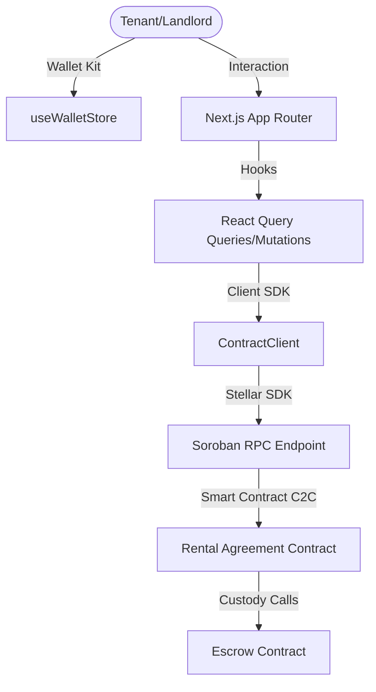

# RentSure – Decentralized Rental Security Deposit Escrow Platform

[](https://github.com/sharma88rahul/rental-deposit-escrow/actions/workflows/frontend-ci.yml)
[](https://github.com/sharma88rahul/rental-deposit-escrow/actions/workflows/rust-ci.yml)
[](https://opensource.org/licenses/MIT)

RentSure is a decentralized rental security deposit management platform built on Stellar Soroban. It replaces traditional opaque deposit accounts with trustless, multi-signature smart vaults, ensuring secure deposit custody, transparent deduction settlements, and arbitrator dispute resolution.

---

## 1. Problem & Solution

### Problem Statement
Traditional security deposit management is plagued by:
- **Lack of Transparency**: Landlords custody funds in private bank accounts, making audits impossible.
- **Unfair Deductions**: Tenants face unjustified repair deductions without peer-to-peer signing validation.
- **Dispute Hurdles**: Solving lease disagreements requires lengthy small-claims court litigation.

### The RentSure Solution
RentSure shifts the trust layer to the Stellar blockchain:
- **Trustless Custody**: Deposits are vaulted in independent Escrow contracts, locked until mutual release splits.
- **P2P Signing Workflows**: Deductions and payouts require cryptographic signature agreements.
- **On-chain Arbitration**: Decentralized dispute logs escalate to registered arbitrators for settlement resolutions.

---

## 2. Features Matrix

- **Multi-Wallet Integrations**: Unified wallet sessions supporting Freighter, Albedo, and xBull wallets.
- **Agreement Lifecycle State Tracking**: Interactive transitions from lease drafting, acceptance signature, locking, and refunds.
- **Arbitrated Escrow Vaults**: Lock funds in SAC (Stellar Asset Contract) assets like USDC or Native XLM.
- **Real-Time Blockchain Activity Feed**: Tracks and normalizes transaction events from Soroban RPC sequences.
- **Analytics & Settings Dashboards**: Custom SVG charts tracking metrics, appearance theme selectors, and RPC connection management.

---

## 3. Architecture Overview



---

## 4. Technology Stack

- **Smart Contracts**: Rust, Soroban SDK
- **Frontend App**: Next.js 15, TypeScript, Tailwind CSS, Framer Motion
- **State & Queries**: Zustand, React Query (TanStack Query)
- **Stellar Connection**: `@stellar/stellar-sdk`, `@creit-tech/stellar-wallets-kit`
- **Unit Testing**: Jest (Frontend), Rust test framework (Contracts)

---

## 5. Folder Structure

```
rental-deposit-escrow/
├── .github/             # Issue templates & GitHub workflows
├── contracts/           # Rust smart contracts & Cargo workspace
├── docs/                # Architectural manuals & guides
├── frontend/            # Next.js frontend application
└── package.json         # Workspace automation scripts
```

---

## 6. Installation & Local Development

### 1. Pre-requisites
- **Node.js** v22+
- **Rust Toolchain** (wasm32-unknown-unknown target)

### 2. Setup Dependencies
From the root workspace folder, run:
```bash
# Install packages
npm run frontend:install
```

### 3. Environment Variables
Create a `.env` file in the root workspace (copying `.env.example`):
```ini
NEXT_PUBLIC_STELLAR_NETWORK=testnet
NEXT_PUBLIC_RPC_URL=https://soroban-testnet.stellar.org
NEXT_PUBLIC_RENTAL_AGREEMENT_ID=CC32FLXF5AQUBFRFRQBBUAXUDFXUSQIQ6DFCK6OOUTQXDTLANUKI5OOE
NEXT_PUBLIC_ESCROW_ID=CANVAZCSTN7MSQKSAKUNAHM6NGVRSN76ZWHUYL2ZY6BBS4IMA6FF4T3N
```

### 4. Live URL of the website
```bash
# Start Next.js server
npm run dev --prefix frontend
```
URL: https://rental-deposit-escrow.vercel.app/

---

## 7. Screenshot of the Website

### Landing Page


### Features and Dashboard


## 8. Testing Procedures

### Run Smart Contract Tests
```bash
cd contracts
cargo test
```

### Run Frontend Unit & Integration Tests
```bash
cd frontend
npm run test
```

---

## 9. Deployment Workflow

Refer to [docs/deployment.md](file:///c:/Users/SHUBHAJEET/Documents/stellar%20project%202/rental-deposit-escrow/docs/deployment.md) for detailed deployment sequences on Stellar Testnet.

---

## 10. License

This project is licensed under the MIT License. See [LICENSE](file:///c:/Users/SHUBHAJEET/Documents/stellar%20project%202/rental-deposit-escrow/LICENSE) for details.
