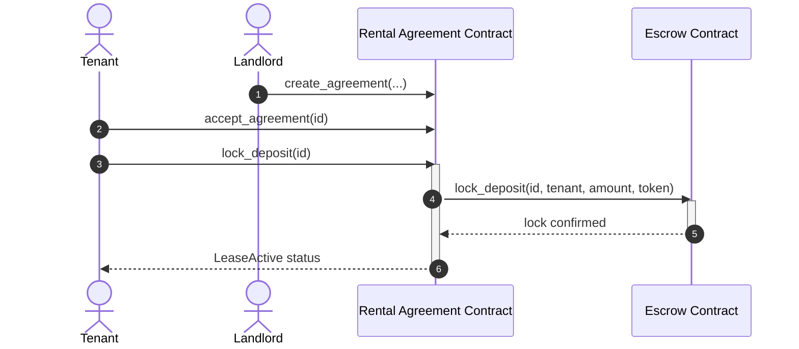

# RentSure Technical Architecture

This document details the smart contract interactions, state synchronization, and UI components hierarchy of the RentSure platform.

---

## 1. Smart Contract C2C Architecture
RentSure utilizes a decoupled contract architecture to split lease metadata state tracking from financial custody operations:



### Decoupling Rationale
- **Access Control Isolation**: The Escrow Contract only accepts calls from the authorized Rental Agreement Contract, preventing external attackers from pulling vaulted funds directly.
- **Gas Efficiency**: Keeping token vault transfers separate from the landlord metadata state checks ensures lower execution costs during dispute escalations.

---

## 2. Frontend Application Architecture
The Next.js 15 application is built using a **Feature-Based Architecture**:

```
frontend/
├── app/                  # App Router Layout Pages
├── components/           # UI Components
│   ├── ui/               # Atom layout components (cards, button, dialog)
│   ├── agreement/        # Agreement creation and timelines
│   └── escrow/           # Escrow release and split forms
├── hooks/                # React Query fetching hooks
├── services/             # Blockchain API interfaces
└── store/                # Zustand client stores
```

---

## 3. Client State Management Flow

### 1. Zustand (Synchronous Client State)
- **`useWalletStore`**: Persistent session details for the active extensions (address, balance, network).
- **`useSettingsStore`**: Custom UI configurations (theme selectors, notification rules, RPC URLs).
- **`useStore`**: Main client data cache mirroring local in-memory records.

### 2. React Query (Asynchronous On-Chain Sync)
- Queries fetch updated parameters from the RPC ledger sequences every 10 seconds.
- Success mutators invalidate cached state queries (`queryClient.invalidateQueries`), forcing the app to fetch the latest state from the blockchain.
