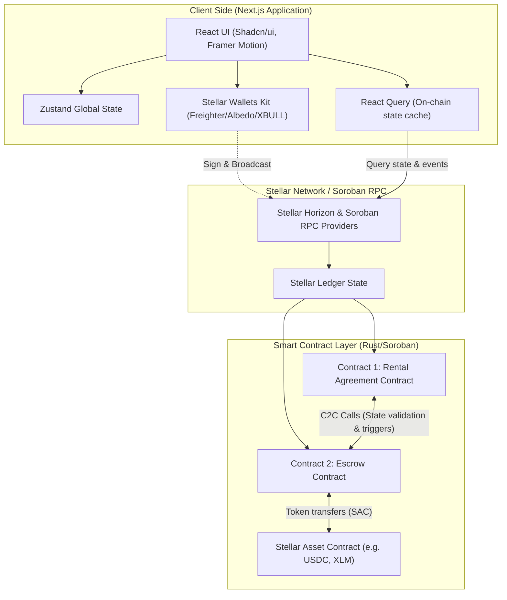
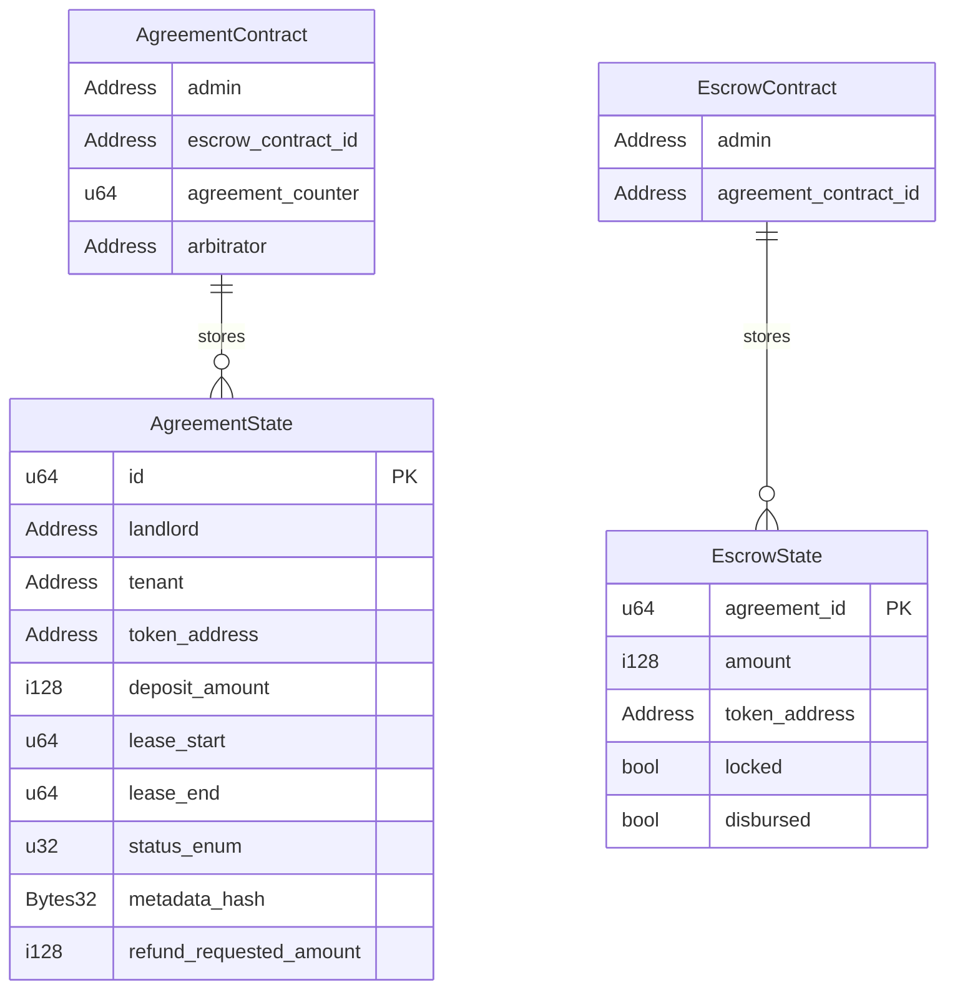
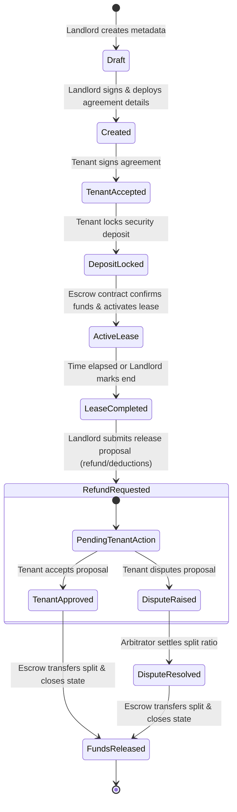
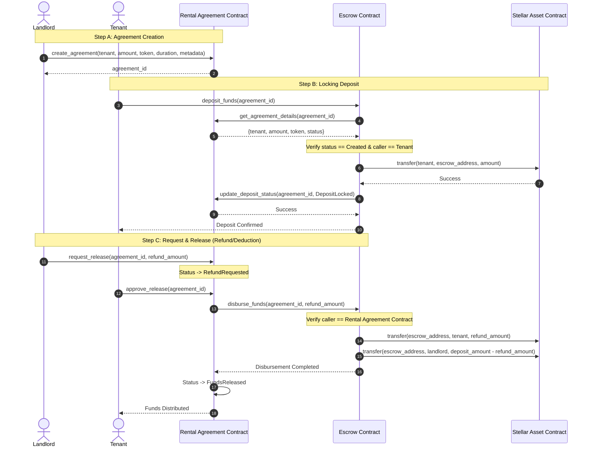

# RentSure System Architecture and Design Document

This document provides a comprehensive blueprint of the RentSure Decentralized Rental Deposit Escrow Platform. It details the system architecture, smart contract data storage model, transaction flows, user state transitions, interface structures, and the development roadmap.

---

## 1. System Architecture

RentSure uses a modern, decentralised web architecture. The Next.js frontend connects to the Stellar network using the Stellar Wallets Kit and custom React Query integrations. Smart contract logic is split into two specialized contracts that communicate on-chain using contract-to-contract (C2C) calls.



---

## 2. Smart Contract Storage Model (ER Diagram)

Soroban uses a key-value store. RentSure maintains configurations in `Instance` storage (which is shared and lives as long as the contract instance) and agreements in `Persistent` storage (requiring periodic TTL bumps).



### Storage Type Assignment
- **Instance Storage**:
  - `Admin` address (both contracts).
  - `Arbitrator` address (Agreement contract).
  - `EscrowContractAddress` / `AgreementContractAddress` cross-references.
  - `AgreementCounter` (monotonically increasing integer).
- **Persistent Storage**:
  - `Agreement` records keyed by `agreement_id`.
  - `Escrow` state records keyed by `agreement_id`.

- **State Archival & TTL management**:
  - Standard TTL threshold of 10,000 ledgers.
  - Every write and read operation on persistent storage will automatically invoke `env.storage().persistent().bump(&key, threshold, limit)` to prevent state eviction.

---

## 3. Rental Agreement Lifecycle State Machine

RentSure strictly validates state transitions to enforce the agreement lifecycle.



---

## 4. Contract-to-Contract (C2C) Interaction Flow

During major milestones, the Agreement contract and the Escrow contract make contract-to-contract calls.



---

## 5. Main User Flow Diagram

The following chart outlines the path for both Landlord and Tenant interactions within the application portal.

```mermaid
flowchart TD
    Start([Connect Wallet via SWK]) --> Role{User Role}
    
    %% Landlord Flow
    Role -->|Landlord| L1[Create Rental Agreement]
    L1 --> L2[Publish to Agreement Contract]
    L2 --> L3[Wait for Tenant acceptance & Deposit]
    L3 -->|Deposit Locked| L4[Lease is Active]
    L4 --> L5[Lease Completed]
    L5 --> L6[Submit Release Proposal (Refund / Deductions)]
    L6 --> L7{Tenant Action?}
    L7 -->|Approve| L8[Funds Distributed Automatically]
    L7 -->|Dispute| L9[Arbitration Process]
    L9 -->|Resolved| L8
    
    %% Tenant Flow
    Role -->|Tenant| T1[View Invited Agreements]
    T1 --> T2[Accept & Review Terms]
    T2 --> T3[Deposit Security Funds into Escrow]
    T3 --> T4[Lease is Active]
    T4 --> T5[Lease Completed]
    T5 --> T6{Review Release Proposal}
    T6 -->|Approve| T7[Receive Refund & Complete]
    T6 -->|Raise Dispute| T8[Submit Dispute Details]
    T8 --> T9[Wait for Arbitrator Decision]
    T9 --> T7
```

---

## 6. UI Wireframes

### Main SaaS Dashboard Layout
```
+----------------------------------------------------------------------------------+
|  [Logo] RentSure           [Wallet Status: Connected (G...xyz) | Network: Testnet] |
+----------------------------------------------------------------------------------+
|  [Sidebar]                 |  [Dashboard Summary Cards]                         |
|  - Dashboard               |  +------------------+ +------------------+          |
|  - Agreements              |  | Total Escrow Bal | | Active Leases    |          |
|  - Escrow Center           |  | $12,500 USDC     | | 8 Agreements     |          |
|  - Transaction Center      |  +------------------+ +------------------+          |
|  - Activity Feed           |                                                     |
|  - Analytics               |  [Recent Activity Feed - Live updates]              |
|  - Settings                |  - Tenant G...abc locked $1,200 deposit (Agreement #4) |
|                            |  - Refund requested for Agreement #2 (Landlord)     |
|                            |                                                     |
|                            |  [Quick Actions]                                    |
|                            |  [Create Agreement]   [Deposit Escrow]   [Resolve]  |
+----------------------------------------------------------------------------------+
```

### Agreement Details View
```
+----------------------------------------------------------------------------------+
|  <- Back to Agreements List                                                      |
+----------------------------------------------------------------------------------+
|  Agreement #1042 - Property: 742 Evergreen Terrace                               |
|  Status: [ Refund Requested ]                                                    |
+----------------------------------------------------------------------------------+
|  [Agreement Terms]                   | [State Timeline]                          |
|  Landlord: G...landlord              |  (x) Drafted                              |
|  Tenant: G...tenant                  |  (x) Created                              |
|  Deposit: 1,500.00 USDC              |  (x) Deposit Locked                       |
|  Duration: 12 Months                 |  (x) Lease Active                         |
|                                      |  (x) Lease Completed                      |
|  [Proposed Release Split]            |  (o) Refund Requested (Pending tenant app) |
|  Tenant Refund: 1,200.00 USDC        |  ( ) Funds Distributed                    |
|  Landlord Deduction: 300.00 USDC     |                                           |
+----------------------------------------------------------------------------------+
|  [Actions - Enabled for Tenant]                                                  |
|  [ Approve Split ]   [ Raise Dispute (arbitration) ]                             |
+----------------------------------------------------------------------------------+
```

---

## 7. Development Roadmap

- **Phase 1**: Project planning, architecture design, diagrams, user flows, and roadmap definition.
- **Phase 2**: Soroban Smart Contracts development (Rental Agreement and Escrow) and Rust unit testing.
- **Phase 3**: Next.js 15 frontend foundation setup, core theme styling, layout structure, and dependencies.
- **Phase 4**: Wallet integration with Stellar Wallets Kit (Freighter, Albedo, XBULL) and session hooks.
- **Phase 5**: Rental Agreement page module, table lists, agreement creation forms, state mapping.
- **Phase 6**: Escrow Center module: contract execution hooks, deposit buttons, custom transaction builders.
- **Phase 7**: Event listener service: fetching RPC events, parsing Soroban event topics, real-time activity feed.
- **Phase 8**: Analytics dashboard page, Lucide charts, average deposit metrics, history breakdown.
- **Phase 9**: Comprehensive integration testing, frontend testing (mocking Soroban provider), end-to-end flow.
- **Phase 10**: CI/CD integration using GitHub Actions (Lint, cargo test, npm test, Next build).
- **Phase 11**: Production/Testnet deployment scripts, contract initialization, parameter locking.
- **Phase 12**: Final documentation updates, deployment guides, user manual, and address publication.
